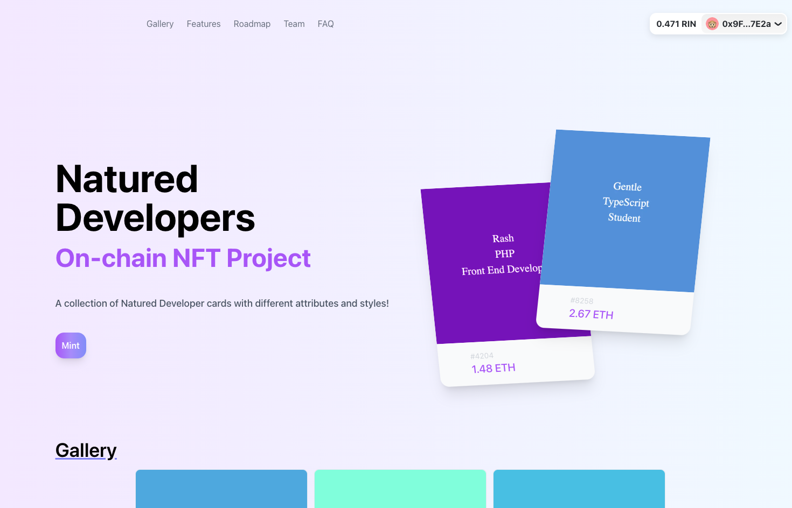

<div id="top"></div>
<!-- PROJECT LOGO -->
<br />
<div align="center">
  <a href="https://github.com/othneildrew/Best-README-Template">
    
  </a>

  <h3 align="center">Next Web3</h3>

  <p align="center">
    A frontend gallery and minting page for Natured Developers collection.
    <br />
    <a href="https://github.com/othneildrew/Best-README-Template"><strong>Explore the docs »</strong></a>
    <br />
    <br />
    <a href="https://next-web3.vercel.app/">View Demo</a>
    ·
    <a href="https://github.com/yonlu/next-web3/issues/new">Report Bug</a>
    ·
    <a href="https://github.com/yonlu/next-web3/issues/new">Request Feature</a>
  </p>
</div>

<!-- TABLE OF CONTENTS -->
<details>
  <summary>Table of Contents</summary>
  <ol>
    <li>
      <a href="#about-the-project">About The Project</a>
      <ul>
        <li><a href="#built-with">Built With</a></li>
      </ul>
    </li>
    <li>
      <a href="#getting-started">Getting Started</a>
      <ul>
        <li><a href="#prerequisites">Prerequisites</a></li>
        <li><a href="#installation">Installation</a></li>
      </ul>
    </li>
    <li><a href="#usage">Usage</a></li>
    <li><a href="#roadmap">Roadmap</a></li>
    <li><a href="#contributing">Contributing</a></li>
    <li><a href="#contact">Contact</a></li>
  </ol>
</details>

<!-- ABOUT THE PROJECT -->

## About The Project



Frontend for Natured Developers, an On-chain ERC721 Project. Currently under development in Rinkeby Ethereum testnet.

<p align="right">(<a href="#top">back to top</a>)</p>

### Built With

- [Next.js](https://nextjs.org/)
- [React.js](https://reactjs.org/)
- [wagmi](https://github.com/tmm/wagmi)
- [rainbowkit](https://github.com/rainbow-me/rainbowkit)

<p align="right">(<a href="#top">back to top</a>)</p>

<!-- GETTING STARTED -->

## Getting Started

To get a local copy up and running follow these simple example steps.

### Prerequisites

- A deployed ERC721 contract

### Installation

1. Get a free Rinkeby Key at [Alchemy](https://www.alchemy.com/).
2. Clone the repo
   ```sh
   git clone https://github.com/yonlu/next-web3.git
   ```
3. Install NPM packages
   ```sh
    npm i
    # or
    yarn
   ```
4. Create `.env.local` at the root directory and enter your Alchemy Key in and the deployed contract address to point to.
   ```sh
     NEXT_PUBLIC_CONTRACT_ADDRESS=<YOUR_CONTRACT_ADDRESS>
     ALCHEMY_API=<YOUR_ALCHEMY_API>
   ```
5. Place the contract's abi in `abis/` directory in `JSON`.
   ```json
   {
     "_format": "hh-sol-artifact-1",
     "contractName": "NaturedDevelopers",
     "sourceName": "contracts/NaturedDevelopers.sol",
     "abi": [
       {
         "inputs": [],
         "stateMutability": "nonpayable",
         "type": "constructor"
       },
     "...": "..."
     ]
   }
   ```

<p align="right">(<a href="#top">back to top</a>)</p>

<!-- USAGE EXAMPLES -->

## Usage

_For usage examples, please refer to [wagmi's docs](https://wagmi.sh/docs/getting-started)_

<p align="right">(<a href="#top">back to top</a>)</p>

<!-- ROADMAP -->

## Roadmap

- [x] Token Preview
- [ ] Personal Collection page
- [ ] Gallery Mode
- [ ] Multiple token mints

See the [open issues](https://github.com/othneildrew/Best-README-Template/issues) for a full list of proposed features (and known issues).

<p align="right">(<a href="#top">back to top</a>)</p>

<!-- CONTRIBUTING -->

## Contributing

Contributions are what make the open source community such an amazing place to learn, inspire, and create. Any contributions you make are **greatly appreciated**.

If you have a suggestion that would make this better, please fork the repo and create a pull request. You can also simply open an issue with the tag "enhancement".

1. Fork the Project
2. Create your Feature Branch (`git checkout -b feature/AmazingFeature`)
3. Commit your Changes (`git commit -m 'Add some AmazingFeature'`)
4. Push to the Branch (`git push origin feature/AmazingFeature`)
5. Open a Pull Request

<p align="right">(<a href="#top">back to top</a>)</p>

<!-- CONTACT -->

## Contact

Lucas Sallada - [@lsallada](https://twitter.com/lsallada) - sallada.lucas@gmail.com

<p align="right">(<a href="#top">back to top</a>)</p>
